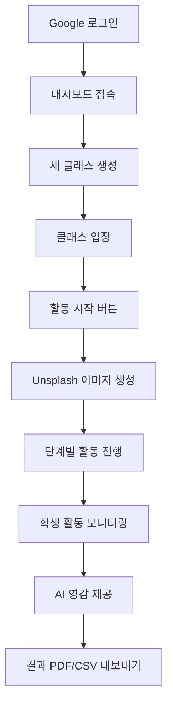
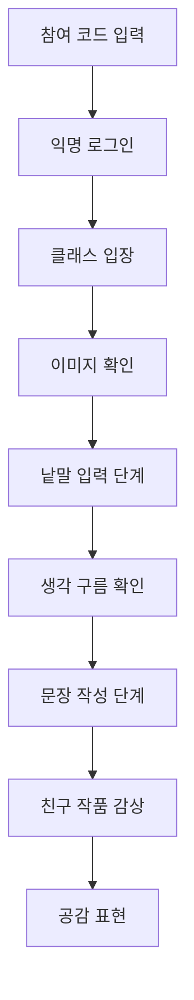
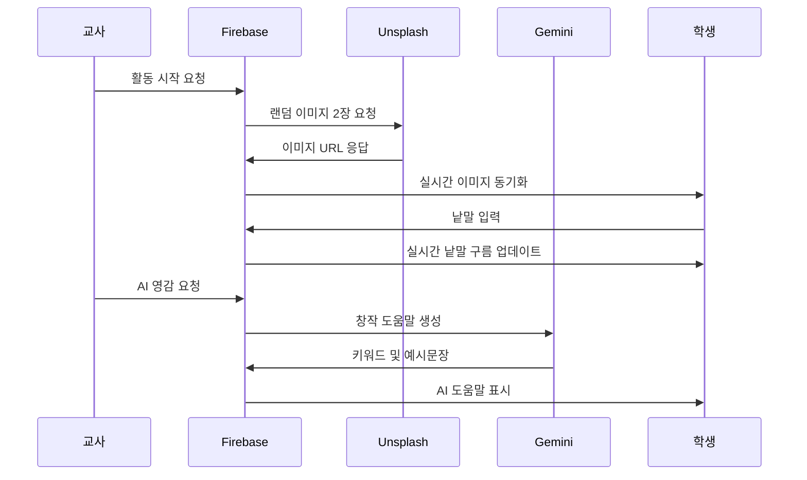

# 상상력을 펼치는 글쓰기 앱 - 기술 명세서

## 📋 목차

1. [개요](#개요)
2. [핵심 기능](#핵심-기능)
3. [기술 아키텍처](#기술-아키텍처)
4. [데이터베이스 구조](#데이터베이스-구조)
5. [사용자 플로우](#사용자-플로우)
6. [보안 및 인증](#보안-및-인증)
7. [외부 API 연동](#외부-api-연동)
8. [배포 및 호스팅](#배포-및-호스팅)
9. [향후 개발 계획](#향후-개발-계획)

---

## 개요

### 프로젝트 설명
**상상력을 펼치는 글쓰기**는 교사와 학생이 함께 참여하는 실시간 창작 활동 플랫폼입니다. 영감을 주는 이미지를 바탕으로 단계별 창작 활동(낱말 → 문장 → 공감)을 통해 학생들의 창의성과 표현력을 기를 수 있도록 설계되었습니다.

### 개발 배경
- **협력 학습**: 같은 이미지를 보고 다양한 관점의 창작물 생성
- **단계적 접근**: 낱말부터 시작하여 문장으로 발전하는 체계적 학습
- **AI 활용**: 창작 영감 제공과 즉각적인 피드백 시스템
- **실시간 공유**: 친구들과 작품을 공유하며 소통하는 경험

### 주요 특징
- 🎨 **시각적 영감**: Unsplash API를 통한 고품질 이미지 제공
- 🤖 **AI 도우미**: Google Gemini를 활용한 창작 영감 및 키워드 제안
- 📱 **반응형 디자인**: 모바일과 데스크톱에서 최적화된 사용자 경험
- ⚡ **실시간 동기화**: Firebase Firestore를 통한 즉시 반영되는 협업
- 📊 **데이터 내보내기**: PDF/CSV 형태로 활동 결과 저장 가능

---

## 핵심 기능

### 1. 교사 기능
#### 1.1 수업 관리
- **클래스 생성**: 고유한 참여 코드 자동 생성
- **활동 제어**: 단계별 활동 진행 관리 (이미지 → 낱말 → 문장)
- **실시간 모니터링**: 학생 참여 현황 실시간 확인
- **결과 내보내기**: PDF/CSV 형태로 활동 결과 다운로드

#### 1.2 AI 도구 활용
- **이미지 자동 생성**: Unsplash API를 통한 영감 이미지 2장 자동 선별
- **AI 영감 제공**: Gemini API를 통한 창작 키워드 및 예시 문장 생성
- **맞춤형 가이드**: 이미지 설명을 바탕으로 한 개별화된 학습 지원

### 2. 학생 기능
#### 2.1 창작 활동
- **낱말 작성**: 이미지를 보고 연상되는 단어 입력
- **문장 창작**: 낱말 구름을 참고하여 창의적 문장 작성
- **공감 표현**: 친구들의 작품에 하트(공감) 표시

#### 2.2 협력 학습
- **실시간 공유**: 작성한 내용이 즉시 모든 참여자에게 공개
- **집단 지성**: 모든 학생의 낱말이 모여 생성되는 "생각 구름"
- **상호 피드백**: 서로의 작품을 읽고 공감을 표현하는 과정

### 3. 공통 기능
#### 3.1 접근성
- **간편한 참여**: 학생은 6자리 코드만으로 즉시 참여 가능
- **익명 로그인**: Google 계정 없이도 활동 참여 가능
- **직관적 UI**: 연령대를 고려한 사용하기 쉬운 인터페이스

#### 3.2 데이터 관리
- **자동 저장**: 모든 활동 내용 클라우드 자동 저장
- **이력 관리**: 과거 활동 내용 조회 및 관리
- **백업 및 복구**: Firebase를 통한 안정적인 데이터 보호

---

## 기술 아키텍처

### 프론트엔드 (Frontend)
```
📁 public/
├── 📄 index.html          # 메인 애플리케이션 페이지
├── 📁 js/
│   ├── 📄 firebase-config.js    # Firebase 설정 (gitignore)
│   └── 📄 firebase-config.template.js  # 설정 템플릿
├── 📁 css/
│   └── 🎨 Tailwind CSS (CDN)   # 반응형 스타일링
└── 📁 assets/               # 정적 자산
```

**기술 스택:**
- **HTML5**: 시맨틱 마크업과 접근성 고려
- **Vanilla JavaScript**: 프레임워크 없는 순수 자바스크립트
- **Tailwind CSS**: 유틸리티 기반 CSS 프레임워크
- **Firebase SDK**: 클라이언트측 Firebase 연동

**주요 특징:**
- ES6 모듈 시스템 활용
- 반응형 디자인 (모바일 우선)
- 실시간 데이터 바인딩
- PWA 준비 가능한 구조

### 백엔드 (Backend)
```
📁 functions/
├── 📄 index.ts             # Cloud Functions 메인 로직
├── 📄 package.json         # 의존성 및 스크립트
├── 📄 .env                 # 환경 변수 (gitignore)
└── 📁 lib/                 # 컴파일된 JavaScript 파일
```

**기술 스택:**
- **Node.js 18**: 서버사이드 런타임
- **TypeScript**: 정적 타입 언어
- **Firebase Functions**: 서버리스 함수 실행 환경
- **Firebase Admin SDK**: 서버측 Firebase 관리

**Cloud Functions 목록:**
1. `startNewActivity`: 새로운 활동 시작 및 이미지 생성
2. `getAiInspiration`: AI 기반 창작 영감 및 키워드 제공

### 데이터베이스 (Database)
**Firebase Firestore** - NoSQL 실시간 데이터베이스

**장점:**
- 실시간 동기화 기능
- 확장성 및 안정성
- 오프라인 지원
- 보안 규칙 내장

---

## 데이터베이스 구조

### 컬렉션 구조

#### 1. `classrooms` 컬렉션
```javascript
{
  "classId": "auto-generated-id",
  "className": "5학년 1반",
  "teacherId": "teacher-google-uid",
  "joinCode": "ABC123",  // 6자리 대문자+숫자
  "createdAt": "2024-01-15T09:00:00Z"
}
```

#### 2. `classrooms/{classId}/appState/current` 문서
```javascript
{
  "currentPhase": "waiting" | "images_only" | "word_input_active" | "sentence_input_active",
  "updatedAt": "2024-01-15T09:30:00Z"
}
```

#### 3. `classrooms/{classId}/sharedImages/current` 문서
```javascript
{
  "url1": "https://images.unsplash.com/photo-xxx",
  "alt1": "A beautiful mountain landscape",
  "url2": "https://images.unsplash.com/photo-yyy", 
  "alt2": "Children playing in the park",
  "updatedAt": "2024-01-15T09:30:00Z"
}
```

#### 4. `classrooms/{classId}/words` 컬렉션
```javascript
{
  "text": "신비로운",
  "authorId": "student-anonymous-uid",
  "createdAt": "2024-01-15T09:35:00Z"
}
```

#### 5. `classrooms/{classId}/sentences` 컬렉션
```javascript
{
  "text": "신비로운 산속에서 아이들이 모험을 떠났다.",
  "authorName": "김민수",
  "authorId": "student-anonymous-uid",
  "likesBy": ["uid1", "uid2", "uid3"],  // 공감한 사용자 목록
  "createdAt": "2024-01-15T09:40:00Z"
}
```

#### 6. `classrooms/{classId}/aiHelper/current` 문서
```javascript
{
  "content": "{\"exampleSentence\": \"예시 문장\", \"keywords\": [\"키워드1\", \"키워드2\"]}",
  "updatedAt": "2024-01-15T09:45:00Z"
}
```

#### 7. `users` 컬렉션 (교사 정보)
```javascript
{
  "uid": "google-account-uid",
  "email": "teacher@school.com",
  "displayName": "김선생",
  "photoURL": "https://lh3.googleusercontent.com/...",
  "lastLogin": "2024-01-15T08:30:00Z"
}
```

### 데이터 플로우

#### 활동 진행 순서:
1. **교사 로그인** → `users` 컬렉션에 정보 저장
2. **클래스 생성** → `classrooms` 컬렉션에 문서 추가
3. **학생 참여** → 익명 인증으로 클래스 입장
4. **활동 시작** → Unsplash에서 이미지 가져와 `sharedImages` 저장
5. **단계별 진행** → `appState` 업데이트로 활동 단계 제어
6. **낱말 입력** → `words` 컬렉션에 실시간 추가
7. **문장 작성** → `sentences` 컬렉션에 저장
8. **AI 도움** → Gemini API 호출 결과를 `aiHelper`에 저장

---

## 사용자 플로우

### 교사 플로우


### 학생 플로우


### 시스템 플로우


---

## 보안 및 인증

### 인증 시스템

#### 교사 인증
- **Google OAuth 2.0**: Firebase Auth를 통한 Google 계정 로그인
- **권한 관리**: 교사만 클래스 생성 및 관리 가능
- **세션 관리**: Firebase Auth의 자동 토큰 관리

#### 학생 인증  
- **익명 인증**: Firebase Anonymous Auth 사용
- **임시 계정**: 활동 종료 시 자동 삭제되는 임시 사용자
- **참여 코드**: 6자리 코드를 통한 클래스 접근 제어

### 보안 정책

#### Firestore Security Rules
```javascript
rules_version = '2';
service cloud.firestore {
  match /databases/{database}/documents {
    // 교사만 클래스 관리 가능
    match /classrooms/{classId} {
      allow read, write: if request.auth != null 
        && request.auth.token.firebase.sign_in_provider == 'google.com'
        && resource.data.teacherId == request.auth.uid;
    }
    
    // 클래스 참여자는 하위 컬렉션 읽기/쓰기 가능
    match /classrooms/{classId}/{subcollection=**} {
      allow read, write: if request.auth != null;
    }
    
    // 사용자 정보는 본인만 접근 가능
    match /users/{userId} {
      allow read, write: if request.auth != null 
        && request.auth.uid == userId;
    }
  }
}
```

#### API 보안
- **환경 변수**: 민감한 API 키는 `.env` 파일로 관리
- **CORS 설정**: 허용된 도메인에서만 API 접근 가능
- **Rate Limiting**: Firebase Functions의 내장 제한 기능 활용

### 데이터 보호
- **클라이언트 측 검증**: 입력 데이터 유효성 검사
- **서버 측 검증**: Cloud Functions에서 추가 검증
- **데이터 암호화**: Firebase의 기본 암호화 적용
- **백업**: Firestore의 자동 백업 기능 활용

---

## 외부 API 연동

### 1. Unsplash API
**목적**: 고품질 영감 이미지 제공

**사용 방식:**
```javascript
const fetchRandomImage = async (query) => {
  const response = await fetch(
    `https://api.unsplash.com/photos/random?query=${query}&orientation=landscape&client_id=${UNSPLASH_ACCESS_KEY}`
  );
  return await response.json();
};
```

**주요 매개변수:**
- `query`: 검색 키워드 ("inspiration", "creativity")
- `orientation`: 이미지 방향 (landscape로 고정)
- `client_id`: Unsplash Access Key

**에러 처리:**
- API 호출 실패 시 기본 이미지 또는 재시도 로직
- Rate limit 도달 시 대체 이미지 서비스 활용

### 2. Google Gemini API
**목적**: AI 기반 창작 영감 및 키워드 제공

**사용 방식:**
```javascript
const generateInspiration = async (imageDescriptions) => {
  const prompt = `Based on two themes, "${alt1}" and "${alt2}", provide creative keywords and example sentences in Korean.`;
  
  const response = await fetch(apiUrl, {
    method: 'POST',
    headers: { 'Content-Type': 'application/json' },
    body: JSON.stringify({
      contents: [{ parts: [{ text: prompt }] }],
      generationConfig: { responseMimeType: "application/json" }
    })
  });
};
```

**응답 구조:**
```json
{
  "exampleSentence": "신비로운 숲에서 아이들이 모험을 시작했어요.",
  "keywords": ["신비로운", "모험", "우정", "발견", "용기", "꿈", "상상", "탐험", "성장", "희망"]
}
```

**프롬프트 엔지니어링:**
- 한국어 초등학생 수준에 맞는 언어 요청
- JSON 형식으로 구조화된 응답 요구
- 창의적이고 교육적인 내용 생성 지시

---

## 배포 및 호스팅

### 호스팅 환경
**Firebase Hosting** - 정적 웹 앱 호스팅 서비스

**장점:**
- CDN을 통한 글로벌 배포
- HTTPS 자동 적용
- 커스텀 도메인 지원
- 원클릭 배포 시스템

### 배포 프로세스

#### 1. 개발 환경 설정
```bash
# Firebase CLI 설치
npm install -g firebase-tools

# 프로젝트 초기화
firebase init hosting functions

# 로컬 개발 서버
firebase serve
```

#### 2. 배포 명령어
```bash
# Functions만 배포
firebase deploy --only functions

# Hosting만 배포  
firebase deploy --only hosting

# 전체 배포
firebase deploy
```

#### 3. 환경별 배포
- **개발환경**: `firebase serve`로 로컬 테스트
- **스테이징**: 별도 Firebase 프로젝트 활용
- **프로덕션**: 메인 프로젝트로 배포

### CI/CD 파이프라인 (향후 계획)
```yaml
# .github/workflows/deploy.yml
name: Deploy to Firebase
on:
  push:
    branches: [main]

jobs:
  deploy:
    runs-on: ubuntu-latest
    steps:
      - uses: actions/checkout@v2
      - uses: actions/setup-node@v2
      - run: npm ci
      - run: npm run build
      - uses: FirebaseExtended/action-hosting-deploy@v0
```

---

## 향후 개발 계획

### 1단계: 핵심 편의 기능 (난이도: 하~중)
- **수정 기능**: 클래스명, 학생 정보, 활동 내용 수정
- **데이터 관리**: 활동 히스토리 조회 및 관리
- **사용자 경험**: 더 직관적인 UI/UX 개선

### 2단계: 기능 확장 (난이도: 중~상)
- **포트폴리오 시스템**: 학생별 작품 모음집 생성
- **첨부파일 지원**: 그림, 사진 등 멀티미디어 첨부
- **협력 기능**: 학생 간 댓글 및 피드백 시스템
- **프로젝트 관리**: 여러 활동을 묶는 큰 프로젝트 단위

### 3단계: 고급 기능 (난이도: 상)
- **데이터 분석**: 학습 패턴 및 성과 시각화
- **AI 튜터**: 개별 학생 맞춤형 AI 지도
- **외부 연동**: LMS, 교육 플랫폼과의 연계
- **음성 지원**: 음성 입력 및 읽어주기 기능

### AI 튜터 고도화 계획
참조된 외부 컨텍스트를 바탕으로 한 발전 방향:

#### AI 페르소나 시스템
- **맞춤형 지시**: 활동별 AI 튜터의 역할과 톤 설정
- **소크라테스식 질문법**: 학생의 사고력 증진을 위한 질문 생성
- **게임화 요소**: 레벨, 경험치, 성취 시스템 도입

#### 학습 분석 기능  
- **개별 포트폴리오**: 학생별 성장 과정 추적
- **학습 패턴 분석**: AI 기반 학습 성향 파악
- **맞춤형 피드백**: 개인별 특성을 고려한 조언 제공

### 기술적 발전 계획

#### PWA (Progressive Web App) 전환
- **오프라인 지원**: 인터넷 없이도 기본 기능 사용
- **푸시 알림**: 새로운 활동 알림 기능
- **앱 설치**: 모바일 홈 화면에 설치 가능

#### 성능 최적화
- **코드 분할**: 필요한 기능만 로드하는 lazy loading
- **이미지 최적화**: WebP 포맷 및 적응형 이미지 크기
- **캐싱 전략**: Service Worker를 통한 효율적 캐싱

#### 접근성 개선
- **다국어 지원**: i18n을 통한 영어, 중국어 등 지원
- **시각적 접근성**: 색맹 고려 색상 설계, 고대비 모드
- **키보드 네비게이션**: 마우스 없이도 완전한 기능 사용

---

## 결론

**상상력을 펼치는 글쓰기** 앱은 현대적인 웹 기술과 AI를 활용하여 교육 현장에 혁신을 가져오는 플랫폼입니다. 

### 핵심 가치
1. **협력학습**: 함께 만들어가는 창작 경험
2. **창의성 증진**: AI와 함께하는 영감 발견
3. **접근성**: 누구나 쉽게 참여할 수 있는 환경
4. **확장성**: 지속적인 발전이 가능한 구조

### 기술적 우수성
- **확장 가능한 아키텍처**: 모듈화된 설계로 기능 추가 용이
- **실시간 동기화**: Firebase를 통한 끊김 없는 협업 환경
- **보안**: 교육 현장에 적합한 안전한 데이터 관리
- **성능**: 모바일 환경에서도 빠르고 부드러운 사용자 경험

이 앱은 단순한 글쓰기 도구를 넘어서, 학생들의 상상력과 표현력을 키우는 종합적인 교육 플랫폼으로 발전할 잠재력을 가지고 있습니다.