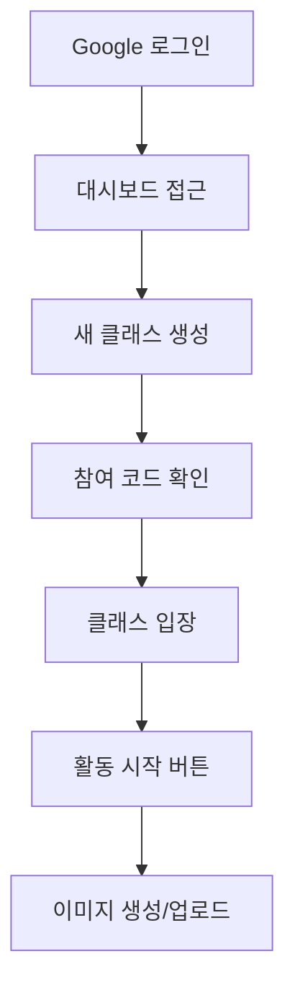
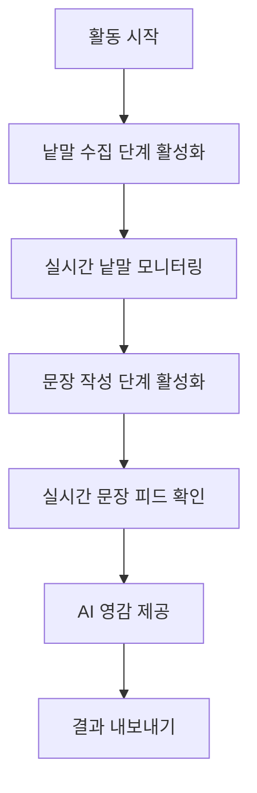
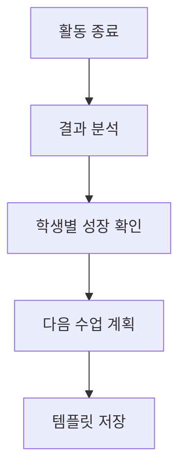
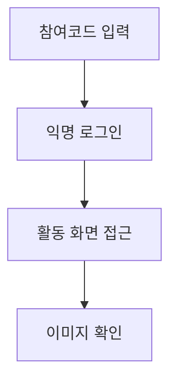
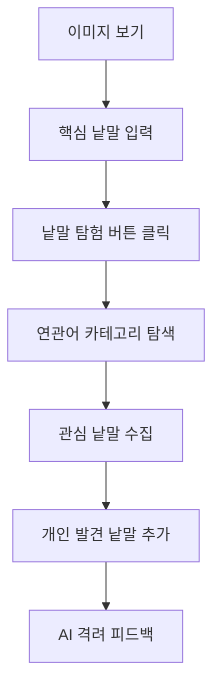
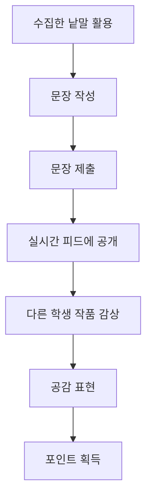

# 상상력을 펼치는 글쓰기 앱 - 상세 개발 계획

## 📋 현재 앱 구조 분석

### 🎯 **기존 앱 vs 계획 문서 비교**

#### 현재 앱의 실제 구조
```
현재 앱: "실시간 낱말/문장 공유 플랫폼"
- 교사가 Google 로그인으로 클래스 생성
- 학생이 참여코드로 익명 접속
- 실시간 이미지 공유 → 낱말 입력 → 문장 작성
- 실시간 피드 & 공감(좋아요) 기능
```

#### 개발 계획 문서의 목표
```
계획 문서: "낱말 탐험 및 AI 튜터 시스템"
- 낱말 사전 연동한 어휘 확장 게임
- AI 피드백 & 개인화 학습 경험  
- 포인트/레벨/배지 게임화 시스템
- 개별 학습 포트폴리오 관리
```

### 🔍 **핵심 차이점 및 개발 방향**
| 영역 | 현재 앱 | 계획 문서 | 개발 전략 |
|------|---------|-----------|-----------|
| **핵심 가치** | 실시간 협업 글쓰기 | 개인화 어휘 학습 | 두 가치를 **통합** - 협업하며 개별 성장 |
| **학습 구조** | 단순 이미지→문장 | 낱말 탐험→확장→문장 | 현재 구조에 **탐험 단계 삽입** |
| **AI 역할** | 영감 제공 도구 | 개인 튜터 & 피드백 | AI 기능을 **점진적 확장** |
| **데이터** | 실시간 공유 중심 | 개인 학습 기록 중심 | **개인+공유 데이터 병행** 관리 |

---

## 🚀 단계별 사용자 여정 매핑

### 👨‍🏫 **교사 사용자 여정**

#### Phase 1: 수업 준비


**필요한 기능:**
- ✅ **이미 구현됨**: Google OAuth, 클래스 CRUD, 참여코드 시스템
- 🔄 **개선 필요**: 클래스/활동 수정 기능, 히스토리 관리

#### Phase 2: 수업 진행


**필요한 기능:**
- ✅ **이미 구현됨**: 단계별 활동 제어, 실시간 피드, CSV/PDF 내보내기
- 🆕 **신규 필요**: 낱말 탐험 시스템, 개별 학생 진도 확인

#### Phase 3: 수업 후 관리


**필요한 기능:**
- 🆕 **신규 필요**: 학습 분석 대시보드, 포트폴리오 시스템, 활동 템플릿

### 👧👦 **학생 사용자 여정**

#### Phase 1: 수업 참여


**필요한 기능:**
- ✅ **이미 구현됨**: 참여코드 시스템, 익명 인증, 실시간 동기화
- 🆕 **신규 필요**: 학생 구글 로그인 기능

#### Phase 2: 낱말 탐험 (신규)


**필요한 기능:**
- 🆕 **신규 개발**: 낱말 탐험 모달, 사전 API 연동, 개인 꾸러미, AI 피드백

#### Phase 3: 문장 창작 & 공유


**필요한 기능:**
- ✅ **이미 구현됨**: 문장 작성/제출, 실시간 피드, 좋아요 시스템
- 🆕 **신규 필요**: 포인트/레벨 시스템, 개인 성장 기록

---

## 🎯 우선순위별 개발 계획

### 🔥 **1단계: 핵심 편의 기능 완성 (2-3주)**

#### 목표: 현재 시스템의 사용성 개선 및 안정성 확보

#### 추가 개선 사항: Google 로그인 및 QR 코드 기능 통합

##### 1.0 Google 로그인 통합 (1주차 초)
**예상 공수: 8시간**

**학생용 Google 로그인 추가:**
```javascript
// 기존 익명 로그인 유지하면서 Google 로그인 옵션 추가
// student.html 또는 join-class.html
const initGoogleAuth = () => {
    gapi.load('auth2', () => {
        gapi.auth2.init({
            client_id: 'YOUR_GOOGLE_CLIENT_ID'
        }).then(() => {
            const authInstance = gapi.auth2.getAuthInstance();
            
            // Google 로그인 버튼 이벤트
            document.getElementById('google-login-btn').addEventListener('click', () => {
                authInstance.signIn().then((user) => {
                    const profile = user.getBasicProfile();
                    const studentData = {
                        name: profile.getName(),
                        email: profile.getEmail(),
                        googleId: profile.getId(),
                        avatar: profile.getImageUrl(),
                        loginType: 'google',
                        joinedAt: new Date()
                    };
                    
                    joinClassWithGoogleAuth(studentData);
                });
            });
        });
    });
};

const joinClassWithGoogleAuth = async (studentData) => {
    try {
        // 클래스 참여 코드 확인
        const joinCode = document.getElementById('join-code').value;
        
        // Firestore에 학생 정보 저장 (개인 식별 가능)
        const result = await firebase.functions().httpsCallable('joinClassWithGoogle')({
            joinCode: joinCode,
            studentData: studentData
        });
        
        if (result.data.success) {
            // 클래스 페이지로 리디렉션
            window.location.href = `student.html?classId=${result.data.classId}&studentId=${result.data.studentId}`;
        }
    } catch (error) {
        console.error('Google login failed:', error);
        alert('로그인에 실패했습니다. 다시 시도해주세요.');
    }
};
```

**UI 개선:**
```html
<!-- 학생 로그인 옵션 추가 -->
<div class="login-options">
    <h3>클래스 참여 방법 선택</h3>
    
    <div class="login-method">
        <button id="anonymous-login-btn" class="btn btn-primary">
            👤 익명으로 참여하기
            <small>이름만 입력하고 빠르게 참여</small>
        </button>
    </div>
    
    <div class="login-divider">
        <span>또는</span>
    </div>
    
    <div class="login-method">
        <button id="google-login-btn" class="btn btn-google">
             
            Google로 참여하기
            <small>내 작품을 개인 포트폴리오에 저장</small>
        </button>
    </div>
</div>
```

##### 1.1 QR 코드 클래스 참여 시스템 (1주차 중)
**예상 공수: 10시간**

**QR 코드 생성 (교사용):**
```javascript
// dashboard.js - 클래스 QR 코드 생성
const generateClassQR = async (classId, joinCode) => {
    const classUrl = `${window.location.origin}/join-class.html?code=${joinCode}`;
    
    // QR 코드 라이브러리 사용 (qrcode.js)
    const qrCodeDataURL = await QRCode.toDataURL(classUrl, {
        width: 256,
        margin: 2,
        color: {
            dark: '#000000',
            light: '#FFFFFF'
        }
    });
    
    return qrCodeDataURL;
};

// QR 코드 모달 표시
const showQRModal = async (classData) => {
    const qrCodeImage = await generateClassQR(classData.id, classData.joinCode);
    
    const modal = document.getElementById('qr-modal');
    modal.innerHTML = `
        <div class="modal-content">
            <div class="modal-header">
                <h2>📱 QR 코드로 클래스 참여</h2>
                <button class="close-modal">✕</button>
            </div>
            
            <div class="modal-body">
                <div class="qr-container">
                    
                    <p class="class-info">
                        <strong>${classData.className}</strong><br>
                        참여 코드: <span class="join-code">${classData.joinCode}</span>
                    </p>
                </div>
                
                <div class="qr-instructions">
                    <h4>📋 참여 방법</h4>
                    <ol>
                        <li>학생들이 스마트폰 카메라로 QR 코드를 스캔합니다</li>
                        <li>자동으로 참여 페이지가 열립니다</li>
                        <li>이름을 입력하고 "참여하기" 버튼을 클릭합니다</li>
                    </ol>
                </div>
                
                <div class="qr-actions">
                    <button id="download-qr" class="btn btn-primary">
                        💾 QR 코드 다운로드
                    </button>
                    <button id="print-qr" class="btn btn-secondary">
                        🖨️ 인쇄하기
                    </button>
                </div>
            </div>
        </div>
    `;
    
    modal.style.display = 'block';
    
    // QR 코드 다운로드 기능
    document.getElementById('download-qr').addEventListener('click', () => {
        const link = document.createElement('a');
        link.download = `${classData.className}_QR코드.png`;
        link.href = qrCodeImage;
        link.click();
    });
    
    // 인쇄 기능
    document.getElementById('print-qr').addEventListener('click', () => {
        const printWindow = window.open('', '_blank');
        printWindow.document.write(`
            <html>
                <head><title>${classData.className} QR 코드</title></head>
                <body style="text-align: center; font-family: Arial;">
                    <h2>${classData.className}</h2>
                    
                    <p>참여 코드: ${classData.joinCode}</p>
                </body>
            </html>
        `);
        printWindow.print();
    });
};
```

**학생용 QR 스캔 자동 참여:**
```javascript
// join-class.html - URL 파라미터에서 참여 코드 자동 추출
const autoFillJoinCode = () => {
    const urlParams = new URLSearchParams(window.location.search);
    const joinCode = urlParams.get('code');
    
    if (joinCode) {
        document.getElementById('join-code').value = joinCode;
        // 추가적으로 클래스 정보 미리 로드
        preloadClassInfo(joinCode);
    }
};

const preloadClassInfo = async (joinCode) => {
    try {
        const classInfo = await firebase.functions().httpsCallable('getClassByJoinCode')({
            joinCode: joinCode
        });
        
        if (classInfo.data.success) {
            // 클래스 정보 미리 표시
            document.getElementById('class-preview').innerHTML = `
                <div class="class-preview-card">
                    <h3>🎯 참여할 클래스</h3>
                    <div class="class-details">
                        <strong>${classInfo.data.className}</strong>
                        <p>교사: ${classInfo.data.teacherName}</p>
                        <p>현재 참여자: ${classInfo.data.currentStudents}명</p>
                    </div>
                </div>
            `;
        }
    } catch (error) {
        console.error('Failed to load class info:', error);
    }
};

// 페이지 로드 시 실행
document.addEventListener('DOMContentLoaded', autoFillJoinCode);
```

##### 1.2 교사별 Gemini API 키 관리 시스템 (1주차 말)
**예상 공수: 12시간**

**API 키 관리 UI:**
```html
<!-- dashboard.html에 설정 섹션 추가 -->
<div class="settings-section">
    <h3>⚙️ AI 설정 관리</h3>
    
    <div class="api-key-management">
        <div class="current-api-status">
            <h4>현재 AI 상태</h4>
            <div id="ai-status-indicator" class="status-indicator">
                <!-- 상태가 동적으로 업데이트됨 -->
            </div>
        </div>
        
        <div class="api-key-form">
            <h4>🔑 Gemini API 키 설정</h4>
            <div class="form-group">
                <label for="gemini-api-key">API 키:</label>
                <div class="input-group">
                    <input type="password" id="gemini-api-key" 
                           placeholder="AIzaSy... (Google AI Studio에서 발급받은 키)" 
                           class="api-key-input">
                    <button type="button" id="toggle-api-visibility" class="btn-icon">👁️</button>
                </div>
                <small class="help-text">
                    📋 <a href="https://makersuite.google.com/app/apikey" target="_blank">Google AI Studio</a>에서 무료로 API 키를 발급받을 수 있습니다.
                </small>
            </div>
            
            <div class="form-actions">
                <button id="test-api-key" class="btn btn-secondary">🧪 연결 테스트</button>
                <button id="save-api-key" class="btn btn-primary">💾 저장하기</button>
                <button id="remove-api-key" class="btn btn-danger">🗑️ 삭제</button>
            </div>
        </div>
        
        <div class="api-usage-info">
            <h4>📊 이번 달 사용량</h4>
            <div class="usage-stats">
                <div class="usage-item">
                    <span>피드백 생성:</span>
                    <span id="feedback-count">0회</span>
                </div>
                <div class="usage-item">
                    <span>예상 비용:</span>
                    <span id="estimated-cost">$0.00</span>
                </div>
            </div>
        </div>
    </div>
</div>
```

**백엔드 API 키 관리:**
```javascript
// Cloud Function - API 키 암호화 저장
exports.saveTeacherAPIKey = functions.https.onCall(async (data, context) => {
    // 인증 확인
    if (!context.auth || !context.auth.uid) {
        throw new functions.https.HttpsError('unauthenticated', '로그인이 필요합니다.');
    }
    
    const { apiKey } = data;
    const teacherId = context.auth.uid;
    
    // API 키 유효성 검증
    const isValidKey = await validateGeminiAPIKey(apiKey);
    if (!isValidKey) {
        throw new functions.https.HttpsError('invalid-argument', '유효하지 않은 API 키입니다.');
    }
    
    // 암호화하여 저장 (crypto 사용)
    const crypto = require('crypto');
    const algorithm = 'aes-256-gcm';
    const secretKey = functions.config().encryption.key; // Firebase 환경변수
    
    const iv = crypto.randomBytes(16);
    const cipher = crypto.createCipher(algorithm, secretKey);
    const encrypted = cipher.update(apiKey, 'utf8', 'hex') + cipher.final('hex');
    const authTag = cipher.getAuthTag();
    
    // Firestore에 암호화된 키 저장
    await admin.firestore().doc(`teachers/${teacherId}`).set({
        encryptedAPIKey: encrypted,
        keyIV: iv.toString('hex'),
        authTag: authTag.toString('hex'),
        keyLastUpdated: admin.firestore.FieldValue.serverTimestamp(),
        apiUsage: {
            monthlyFeedbackCount: 0,
            lastResetDate: admin.firestore.FieldValue.serverTimestamp()
        }
    }, { merge: true });
    
    return { success: true, message: 'API 키가 안전하게 저장되었습니다.' };
});

// API 키 복호화 및 사용
const getDecryptedAPIKey = async (teacherId) => {
    const teacherDoc = await admin.firestore().doc(`teachers/${teacherId}`).get();
    
    if (!teacherDoc.exists || !teacherDoc.data().encryptedAPIKey) {
        throw new Error('API 키가 설정되지 않았습니다.');
    }
    
    const data = teacherDoc.data();
    const decipher = crypto.createDecipher('aes-256-gcm', functions.config().encryption.key);
    decipher.setAuthTag(Buffer.from(data.authTag, 'hex'));
    
    const decrypted = decipher.update(data.encryptedAPIKey, 'hex', 'utf8') + decipher.final('utf8');
    return decrypted;
};

// 수정된 AI 피드백 생성 함수
exports.generateAIFeedbackWithPersonalKey = functions.https.onCall(async (data, context) => {
    const { classId, activityId } = data;
    const teacherId = context.auth.uid;
    
    try {
        // 교사의 개인 API 키 가져오기
        const apiKey = await getDecryptedAPIKey(teacherId);
        
        // Gemini API 설정
        const { GoogleGenerativeAI } = require('@google/generative-ai');
        const genAI = new GoogleGenerativeAI(apiKey);
        const model = genAI.getGenerativeModel({ model: 'gemini-pro' });
        
        // 학생 문장들 수집
        const sentences = await getSentencesForActivity(classId, activityId);
        
        const prompt = `
            다음은 초등학생들이 창작한 문장들입니다:
            ${sentences.map(s => `- ${s.text} (${s.author})`).join('\n')}
            
            이 문장들을 분석하고 다음 형식으로 피드백을 제공해주세요:
            1. 전체적인 평가 (2-3문장)
            2. 창의적인 표현 칭찬 (구체적 예시 포함)
            3. 다음 활동을 위한 격려 메시지
            
            톤: 친근하고 격려하는, 초등학생 수준에 맞는 언어 사용
        `;
        
        const result = await model.generateContent(prompt);
        const feedback = result.response.text();
        
        // 사용량 카운트 업데이트
        await updateAPIUsage(teacherId);
        
        // 피드백 저장
        await admin.firestore()
            .doc(`classrooms/${classId}/activities/${activityId}`)
            .update({
                aiFeedback: feedback,
                feedbackGeneratedAt: admin.firestore.FieldValue.serverTimestamp(),
                feedbackModel: 'gemini-pro'
            });
        
        return { success: true, feedback: feedback };
        
    } catch (error) {
        if (error.message.includes('API 키')) {
            throw new functions.https.HttpsError('failed-precondition', 
                'API 키를 먼저 설정해주세요. 대시보드의 AI 설정에서 Gemini API 키를 등록할 수 있습니다.');
        }
        throw new functions.https.HttpsError('internal', 
            `AI 피드백 생성 중 오류가 발생했습니다: ${error.message}`);
    }
});
```

#### 1.1 데이터 수정 기능 (1주차)
**예상 공수: 15시간**

```javascript
// 구현할 API 함수들
// functions/index.js
exports.updateClassroom = functions.https.onCall(async (data, context) => {
    const { classId, updates } = data;
    
    // 권한 확인: 교사만 수정 가능
    if (!context.auth || !context.auth.uid) {
        throw new functions.https.HttpsError('unauthenticated', '로그인이 필요합니다.');
    }
    
    // 클래스 소유자 확인
    const classDoc = await admin.firestore().doc(`classrooms/${classId}`).get();
    if (!classDoc.exists || classDoc.data().teacherId !== context.auth.uid) {
        throw new functions.https.HttpsError('permission-denied', '수정 권한이 없습니다.');
    }
    
    // 허용된 필드만 업데이트
    const allowedFields = ['className', 'description'];
    const filteredUpdates = {};
    for (const [key, value] of Object.entries(updates)) {
        if (allowedFields.includes(key)) {
            filteredUpdates[key] = value;
        }
    }
    
    await admin.firestore().doc(`classrooms/${classId}`).update({
        ...filteredUpdates,
        updatedAt: admin.firestore.FieldValue.serverTimestamp()
    });
    
    return { success: true, message: '클래스 정보가 업데이트되었습니다.' };
});
```

**UI 구현:**
```html
<!-- dashboard.html에 추가 -->
<div class="class-item">
    <div class="class-info">
        <h4 class="class-name-display">${classroom.className}</h4>
        <input class="class-name-edit hidden" value="${classroom.className}">
    </div>
    <div class="class-actions">
        <button class="edit-class-btn" data-id="${classId}">✏️ 수정</button>
        <button class="save-class-btn hidden" data-id="${classId}">💾 저장</button>
        <button class="cancel-edit-btn hidden">❌ 취소</button>
    </div>
</div>
```

#### 1.2 활동 히스토리 관리 (2주차)
**예상 공수: 20시간**

**데이터베이스 스키마 확장:**
```javascript
// classrooms/{classId}/activities/{activityId}
{
    title: "봄 풍경 묘사하기",
    description: "봄 이미지를 보고 감성적인 문장 만들기",
    imageUrl1: "https://...",
    imageUrl2: "https://...",
    status: "completed", // "draft", "in_progress", "completed"
    createdAt: timestamp,
    completedAt: timestamp,
    participantCount: 25,
    resultSummary: {
        totalWords: 120,
        totalSentences: 45,
        topKeywords: ["봄", "꽃", "따뜻한"],
        averageWordsPerSentence: 2.7
    }
}
```

#### 1.3 AI 피드백 수동 생성 (2주차)
**예상 공수: 12시간**

```javascript
// 기존 자동 트리거 제거 및 수동 함수 추가
exports.generateAIFeedback = functions.https.onCall(async (data, context) => {
    const { classId, activityId } = data;
    
    // 권한 확인 후 OpenAI API 호출
    const sentences = await getSentencesForActivity(classId, activityId);
    const feedback = await openai.chat.completions.create({
        model: "gpt-3.5-turbo",
        messages: [{
            role: "user", 
            content: `다음 학생들의 창작 문장을 분석하고 격려하는 피드백을 제공해주세요: ${sentences.join(', ')}`
        }]
    });
    
    // 피드백 저장
    await admin.firestore()
        .doc(`classrooms/${classId}/activities/${activityId}`)
        .update({
            aiFeedback: feedback.choices[0].message.content,
            feedbackGeneratedAt: admin.firestore.FieldValue.serverTimestamp()
        });
        
    return { success: true, feedback: feedback.choices[0].message.content };
});
```

#### 1.3 AI 피드백 실시간 업데이트 개선 (2주차)
**예상 공수: 8시간**

**문제**: 기존에는 AI 피드백 생성 버튼을 클릭한 후 사용자가 수동으로 페이지를 새로고침해야 생성된 피드백을 볼 수 있었음.

**해결책**: onSnapshot 리스너를 추가하여 실시간 업데이트 구현

```javascript
// experiment-details.js - AI 피드백 실시간 모니터링 추가
const generateAIFeedbackWithRealTimeUpdate = async (classId, activityId) => {
    try {
        // 로딩 상태 표시
        const feedbackContainer = document.getElementById('ai-feedback-container');
        feedbackContainer.innerHTML = `
            <div class="loading-state">
                <div class="spinner"></div>
                <p>AI가 피드백을 생성하고 있습니다... (최대 30초)</p>
            </div>
        `;
        
        // 실시간 리스너 설정 (Cloud Function 호출 전에 설정)
        const activityRef = db.doc(`classrooms/${classId}/activities/${activityId}`);
        let feedbackListener;
        let timeoutId;
        
        const cleanupListeners = () => {
            if (feedbackListener) {
                feedbackListener();
            }
            if (timeoutId) {
                clearTimeout(timeoutId);
            }
        };
        
        // 30초 타임아웃 설정
        timeoutId = setTimeout(() => {
            cleanupListeners();
            feedbackContainer.innerHTML = `
                <div class="timeout-message">
                    <p>⏰ AI 피드백 생성이 예상보다 오래 걸리고 있습니다.</p>
                    <p>잠시 후 페이지를 새로고침해주세요.</p>
                    <button onclick="location.reload()" class="btn btn-secondary">새로고침</button>
                </div>
            `;
        }, 30000);
        
        // 실시간 피드백 감지
        feedbackListener = activityRef.onSnapshot((doc) => {
            if (doc.exists) {
                const data = doc.data();
                if (data.aiFeedback && data.feedbackGeneratedAt) {
                    // 새로운 피드백이 생성됨
                    cleanupListeners();
                    displayAIFeedback(data.aiFeedback, data.feedbackGeneratedAt.toDate());
                }
            }
        });
        
        // Cloud Function 호출
        const result = await firebase.functions().httpsCallable('generateAIFeedbackWithPersonalKey')({
            classId: classId,
            activityId: activityId
        });
        
        // 만약 즉시 응답이 왔다면 리스너 정리
        if (result.data.success) {
            cleanupListeners();
            displayAIFeedback(result.data.feedback, new Date());
        }
        
    } catch (error) {
        console.error('AI feedback generation failed:', error);
        document.getElementById('ai-feedback-container').innerHTML = `
            <div class="error-state">
                <p>❌ AI 피드백 생성 중 오류가 발생했습니다.</p>
                <p>${error.message}</p>
                <button onclick="generateAIFeedbackWithRealTimeUpdate('${classId}', '${activityId}')" 
                        class="btn btn-primary">다시 시도</button>
            </div>
        `;
    }
};

const displayAIFeedback = (feedback, generatedAt) => {
    const container = document.getElementById('ai-feedback-container');
    container.innerHTML = `
        <div class="ai-feedback-success">
            <div class="feedback-header">
                <h4>🤖 AI 피드백</h4>
                <small class="generated-time">${generatedAt.toLocaleString()} 생성</small>
            </div>
            <div class="feedback-content">
                ${feedback.replace(/\n/g, '<br>')}
            </div>
            <div class="feedback-actions">
                <button onclick="regenerateAIFeedback()" class="btn btn-secondary btn-sm">
                    🔄 다시 생성
                </button>
            </div>
        </div>
    `;
};
```

#### 1.4 사용자 경험 개선 (3주차)  
**예상 공수: 10시간**

**로딩 상태 & 에러 처리:**
```javascript
// 공통 유틸리티 함수
const showLoadingSpinner = (elementId) => {
    document.getElementById(elementId).innerHTML = `
        <div class="flex justify-center items-center p-8">
            <div class="spinner"></div>
            <span class="ml-3">처리 중...</span>
        </div>
    `;
};

const showError = (elementId, message) => {
    document.getElementById(elementId).innerHTML = `
        <div class="bg-red-100 border border-red-400 text-red-700 px-4 py-3 rounded">
            <strong>오류:</strong> ${message}
            <button onclick="location.reload()" class="ml-4 underline">다시 시도</button>
        </div>
    `;
};
```

---

### 📈 **2단계: 핵심 기능 확장 (4-6주)**

#### 목표: 낱말 탐험 시스템 구축 및 개인화 학습 경험 제공

#### 2.0 첨부파일 관리 시스템 (4주차)
**예상 공수: 25시간**

**전체 개발 계획 요약:**

##### Phase 1: 인프라 구축
- Firebase Storage 파일 구조 설계
- Firestore 메타데이터 모델 구성
- 보안 규칙 및 접근 권한 설정

##### Phase 2: UI 구현
- 파일 업로드 인터페이스
- 손글씨 캔버스 모달 및 드로잉 도구
- 첨부파일 미리보기 및 관리 UI

##### Phase 3: JavaScript 구현
- AttachmentManager 클래스 개발
- HandwritingCanvas 클래스 개발
- 실시간 첨부파일 동기화 기능

##### Phase 4: 통합
- 보고서 제출 시 첨부파일 통합
- 교사용 첨부파일 갤러리 뷰
- 학생 포트폴리오 첨부파일 표시

##### Phase 5: 고급 기능
- 이미지 편집 기능
- 교사 주석 시스템
- 첨부파일 버전 관리
- 모바일 최적화 및 카메라 연동

##### Phase 6: 성능 및 보안
- 파일 압축 및 최적화
- 보안 검증 및 바이러스 스캔
- 저장 용량 관리

**구현 예시 코드 (파일 업로드 시스템):**
```javascript
// AttachmentManager 클래스 구현
class AttachmentManager {
    constructor(userId, classId, activityId) {
        this.userId = userId;
        this.classId = classId;
        this.activityId = activityId;
        this.storageRef = firebase.storage().ref();
        this.db = firebase.firestore();
        this.attachments = [];
        this.maxFileSize = 5 * 1024 * 1024; // 5MB
        this.allowedTypes = ['image/jpeg', 'image/png', 'image/gif', 'application/pdf'];
    }
    
    // 파일 업로드 처리
    async uploadFile(file) {
        // 파일 유효성 검사
        if (!this.validateFile(file)) {
            throw new Error('파일 크기 또는 유형이 허용되지 않습니다.');
        }
        
        // 고유 파일명 생성 (timestamp + 원본파일명)
        const timestamp = new Date().getTime();
        const fileName = `${timestamp}_${file.name}`;
        const filePath = `attachments/${this.classId}/${this.activityId}/${this.userId}/${fileName}`;
        
        // Storage에 업로드
        const fileRef = this.storageRef.child(filePath);
        const uploadTask = fileRef.put(file);
        
        return new Promise((resolve, reject) => {
            uploadTask.on('state_changed', 
                // 진행 상태 업데이트
                (snapshot) => {
                    const progress = (snapshot.bytesTransferred / snapshot.totalBytes) * 100;
                    console.log(`Upload progress: ${progress}%`);
                },
                // 오류 처리
                (error) => {
                    console.error('Upload failed:', error);
                    reject(error);
                },
                // 완료 처리
                async () => {
                    // 다운로드 URL 가져오기
                    const downloadURL = await uploadTask.snapshot.ref.getDownloadURL();
                    
                    // Firestore에 메타데이터 저장
                    const attachmentData = {
                        fileName: file.name,
                        fileType: file.type,
                        fileSize: file.size,
                        storagePath: filePath,
                        downloadURL: downloadURL,
                        uploadedAt: firebase.firestore.FieldValue.serverTimestamp(),
                        uploadedBy: this.userId,
                        status: 'active'
                    };
                    
                    // 첨부파일 메타데이터 Firestore에 저장
                    await this.db.collection(`classrooms/${this.classId}/activities/${this.activityId}/attachments`)
                        .add(attachmentData);
                    
                    resolve({
                        success: true,
                        fileData: attachmentData
                    });
                }
            );
        });
    }
    
    // 파일 유효성 검사
    validateFile(file) {
        if (file.size > this.maxFileSize) {
            console.error(`File too large: ${file.size} bytes`);
            return false;
        }
        
        if (!this.allowedTypes.includes(file.type)) {
            console.error(`File type not allowed: ${file.type}`);
            return false;
        }
        
        return true;
    }
    
    // 첨부파일 목록 가져오기
    async getAttachments() {
        const snapshot = await this.db
            .collection(`classrooms/${this.classId}/activities/${this.activityId}/attachments`)
            .where('uploadedBy', '==', this.userId)
            .where('status', '==', 'active')
            .orderBy('uploadedAt', 'desc')
            .get();
        
        this.attachments = [];
        snapshot.forEach(doc => {
            this.attachments.push({
                id: doc.id,
                ...doc.data()
            });
        });
        
        return this.attachments;
    }
    
    // 첨부파일 삭제
    async deleteAttachment(attachmentId) {
        const docRef = this.db
            .doc(`classrooms/${this.classId}/activities/${this.activityId}/attachments/${attachmentId}`);
        
        const doc = await docRef.get();
        if (!doc.exists) {
            throw new Error('첨부파일을 찾을 수 없습니다.');
        }
        
        const data = doc.data();
        
        // Storage에서 파일 삭제
        await this.storageRef.child(data.storagePath).delete();
        
        // Firestore에서 메타데이터 삭제 (또는 status 변경)
        await docRef.update({
            status: 'deleted',
            deletedAt: firebase.firestore.FieldValue.serverTimestamp()
        });
        
        return { success: true };
    }
}
```

**손글씨 캔버스 구현:**
```javascript
// HandwritingCanvas 클래스
class HandwritingCanvas {
    constructor(canvasElement, options = {}) {
        this.canvas = canvasElement;
        this.context = this.canvas.getContext('2d');
        this.isDrawing = false;
        this.lastX = 0;
        this.lastY = 0;
        
        // 기본 설정
        this.lineWidth = options.lineWidth || 3;
        this.lineColor = options.lineColor || '#000000';
        this.backgroundColor = options.backgroundColor || '#ffffff';
        
        // 캔버스 초기화
        this.clearCanvas();
        
        // 이벤트 리스너 설정
        this.setupEventListeners();
    }
    
    // 이벤트 리스너 설정
    setupEventListeners() {
        // 터치 및 마우스 이벤트 처리
        this.canvas.addEventListener('mousedown', this.startDrawing.bind(this));
        this.canvas.addEventListener('mousemove', this.draw.bind(this));
        this.canvas.addEventListener('mouseup', this.stopDrawing.bind(this));
        this.canvas.addEventListener('mouseout', this.stopDrawing.bind(this));
        
        // 터치 이벤트
        this.canvas.addEventListener('touchstart', (e) => {
            e.preventDefault();
            this.startDrawing(this.getTouchPos(e));
        });
        
        this.canvas.addEventListener('touchmove', (e) => {
            e.preventDefault();
            this.draw(this.getTouchPos(e));
        });
        
        this.canvas.addEventListener('touchend', (e) => {
            e.preventDefault();
            this.stopDrawing();
        });
    }
    
    // 터치 위치 가져오기
    getTouchPos(touchEvent) {
        const rect = this.canvas.getBoundingClientRect();
        const touch = touchEvent.touches[0];
        
        return {
            clientX: touch.clientX - rect.left,
            clientY: touch.clientY - rect.top
        };
    }
    
    // 그리기 시작
    startDrawing(e) {
        this.isDrawing = true;
        [this.lastX, this.lastY] = [e.clientX - this.canvas.offsetLeft, e.clientY - this.canvas.offsetTop];
    }
    
    // 그리기
    draw(e) {
        if (!this.isDrawing) return;
        
        const x = e.clientX - this.canvas.offsetLeft;
        const y = e.clientY - this.canvas.offsetTop;
        
        // 선 그리기
        this.context.beginPath();
        this.context.moveTo(this.lastX, this.lastY);
        this.context.lineTo(x, y);
        this.context.lineWidth = this.lineWidth;
        this.context.strokeStyle = this.lineColor;
        this.context.lineCap = 'round';
        this.context.lineJoin = 'round';
        this.context.stroke();
        
        [this.lastX, this.lastY] = [x, y];
    }
    
    // 그리기 중지
    stopDrawing() {
        this.isDrawing = false;
    }
    
    // 캔버스 초기화
    clearCanvas() {
        this.context.fillStyle = this.backgroundColor;
        this.context.fillRect(0, 0, this.canvas.width, this.canvas.height);
    }
    
    // 설정 변경
    setOptions(options) {
        if (options.lineWidth) this.lineWidth = options.lineWidth;
        if (options.lineColor) this.lineColor = options.lineColor;
        if (options.backgroundColor) {
            this.backgroundColor = options.backgroundColor;
            this.clearCanvas(); // 배경색 변경 시 캔버스 초기화
        }
    }
    
    // 이미지로 변환
    async toImage(format = 'image/png', quality = 0.8) {
        return new Promise((resolve) => {
            const imageData = this.canvas.toDataURL(format, quality);
            resolve(imageData);
        });
    }
    
    // Blob으로 변환 (업로드용)
    async toBlob(format = 'image/png', quality = 0.8) {
        return new Promise((resolve) => {
            this.canvas.toBlob((blob) => {
                resolve(blob);
            }, format, quality);
        });
    }
}
```


#### 2.1 낱말 탐험 시스템 (4-5주차)
**예상 공수: 35시간**

**데이터베이스 스키마:**
```javascript
// 학생 개인 데이터
// classrooms/{classId}/students/{studentId}
{
    name: "김민지", // 실명 또는 닉네임
    anonymousId: "user_anonymous_id", // 익명 사용자와 연결
    wordCollection: [
        {
            word: "황홀한",
            category: "형용사",
            source: "ai_suggestion", // "ai_suggestion", "user_input", "dictionary"
            discoveredAt: timestamp,
            usedInSentences: ["황홀한 노을이 지고 있다."]
        }
    ],
    activityHistory: [
        {
            activityId: "activity_001",
            wordsDiscovered: 5,
            sentencesCreated: 2,
            peersLiked: 3,
            pointsEarned: 25
        }
    ],
    totalPoints: 150,
    level: 3,
    badges: ["first_sentence", "word_explorer", "popular_author"]
}
```

**낱말 탐험 모달 UI:**
```html
<!-- 낱말 탐험 팝업 -->
<div id="word-exploration-modal" class="fixed inset-0 bg-black bg-opacity-50 hidden z-50">
    <div class="flex items-center justify-center min-h-screen p-4">
        <div class="bg-white rounded-2xl max-w-4xl w-full max-h-[90vh] overflow-y-auto">
            <div class="p-6">
                <h2 class="text-2xl font-bold text-center mb-4">
                    🔍 "<span id="exploration-word"></span>" 낱말 탐험
                </h2>
                
                <!-- 탭 메뉴 -->
                <div class="flex border-b mb-4">
                    <button class="tab-btn active" data-category="adjectives">✨ 관련 형용사</button>
                    <button class="tab-btn" data-category="verbs">🏃 어울리는 동사</button>
                    <button class="tab-btn" data-category="metaphors">🎭 비유 표현</button>
                    <button class="tab-btn" data-category="opposites">⚖️ 반대말</button>
                </div>
                
                <!-- 탭 콘텐츠 -->
                <div id="exploration-content" class="mb-6">
                    <!-- 낱말 카드들이 동적으로 생성됨 -->
                </div>
                
                <!-- 개인 발견 입력 -->
                <div class="bg-yellow-50 p-4 rounded-lg">
                    <h3 class="font-bold mb-2">✨ 내가 발견한 비슷한 낱말</h3>
                    <div class="flex gap-2">
                        <input type="text" id="personal-word-input" 
                               placeholder="떠오르는 단어를 입력해보세요!" 
                               class="flex-1 p-2 border rounded-lg">
                        <button id="add-personal-word-btn" class="bg-yellow-500 text-white px-4 py-2 rounded-lg">
                            추가하기
                        </button>
                    </div>
                </div>
                
                <!-- 나의 낱말 꾸러미 -->
                <div class="mt-4">
                    <h3 class="font-bold mb-2">🎒 나의 낱말 꾸러미</h3>
                    <div id="word-collection-display" class="flex flex-wrap gap-2">
                        <!-- 수집한 낱말들이 표시됨 -->
                    </div>
                </div>
                
                <div class="flex justify-end gap-2 mt-6">
                    <button id="close-exploration-btn" class="px-4 py-2 border rounded-lg">닫기</button>
                </div>
            </div>
        </div>
    </div>
</div>
```

**API 연동 로직:**
```javascript
// 낱말 확장 API (외부 사전 연동)
const exploreWord = async (word, category) => {
    try {
        // Option 1: 위키낱말사전 API (무료)
        const response = await fetch(`https://ko.wiktionary.org/api/rest_v1/page/summary/${word}`);
        
        // Option 2: 네이버 사전 API (유료)
        // const response = await fetch(`https://openapi.naver.com/v1/search/encyc.json?query=${word}`);
        
        // Option 3: OpenAI를 사용한 어휘 확장
        const aiResponse = await functions.httpsCallable('expandVocabulary')({
            word: word,
            category: category
        });
        
        return aiResponse.data;
    } catch (error) {
        console.error('Word exploration failed:', error);
        return { suggestions: [] };
    }
};

// Cloud Function
exports.expandVocabulary = functions.https.onCall(async (data) => {
    const { word, category } = data;
    
    const prompts = {
        adjectives: `"${word}"와 관련된 형용사 5개를 제안해주세요. 초등학생이 이해할 수 있는 단어로만 구성해주세요.`,
        verbs: `"${word}"와 어울리는 동사 5개를 제안해주세요.`,
        metaphors: `"${word}"를 사용한 비유적 표현 3개를 제안해주세요.`,
        opposites: `"${word}"의 반대말이나 대조되는 단어들을 3개 제안해주세요.`
    };
    
    const completion = await openai.chat.completions.create({
        model: "gpt-3.5-turbo",
        messages: [{
            role: "user",
            content: prompts[category]
        }],
        temperature: 0.7
    });
    
    // 응답을 파싱하여 단어 배열로 변환
    const suggestions = parseAIResponse(completion.choices[0].message.content);
    
    return { suggestions };
});
```

#### 2.2 게임화 시스템 (5주차)
**예상 공수: 25시간**

**포인트 & 레벨 시스템:**
```javascript
// 포인트 계산 로직
const calculatePoints = (action, context) => {
    const pointSystem = {
        WORD_DISCOVERY: 5,           // 새 낱말 발견
        PERSONAL_WORD_ADD: 10,       // 개인 낱말 추가
        SENTENCE_CREATION: 15,       // 문장 창작
        PEER_LIKE_RECEIVED: 3,       // 공감 받기
        PEER_LIKE_GIVEN: 2,          // 공감 주기
        EXPLORATION_COMPLETE: 20,    // 탐험 완료
        CREATIVE_BONUS: 10           // 창의성 보너스 (AI 판정)
    };
    
    return pointSystem[action] || 0;
};

// 배지 획득 조건
const checkBadgeEarned = (studentData) => {
    const badges = [];
    
    if (studentData.activityHistory.length === 1) {
        badges.push({
            id: 'first_activity',
            title: '첫 발걸음',
            description: '첫 번째 활동에 참여했어요!',
            icon: '👶',
            earnedAt: new Date()
        });
    }
    
    if (studentData.wordCollection.length >= 10) {
        badges.push({
            id: 'word_collector',
            title: '낱말 수집가',
            description: '10개의 낱말을 수집했어요!',
            icon: '📚'
        });
    }
    
    const totalLikes = studentData.activityHistory.reduce((sum, activity) => 
        sum + activity.peersLiked, 0);
    if (totalLikes >= 10) {
        badges.push({
            id: 'popular_author',
            title: '인기 작가',
            description: '10개 이상의 공감을 받았어요!',
            icon: '⭐'
        });
    }
    
    return badges;
};
```

#### 2.3 학생 포트폴리오 시스템 (6주차)
**예상 공수: 30시간**

**포트폴리오 UI:**
```html
<!-- student-portfolio.html -->
<div class="portfolio-container">
    <header class="student-profile">
        <div class="avatar">👧</div>
        <div class="info">
            <h2 id="student-name">김민지</h2>
            <div class="level-info">
                <span class="level">Level 3</span>
                <div class="progress-bar">
                    <div class="progress" style="width: 65%"></div>
                </div>
                <span class="points">150/200 포인트</span>
            </div>
        </div>
    </header>
    
    <section class="badges">
        <h3>🏆 획득한 배지</h3>
        <div class="badge-grid">
            <div class="badge">
                <div class="badge-icon">👶</div>
                <div class="badge-name">첫 발걸음</div>
            </div>
            <div class="badge">
                <div class="badge-icon">📚</div>
                <div class="badge-name">낱말 수집가</div>
            </div>
        </div>
    </section>
    
    <section class="word-collection">
        <h3>🎒 나의 낱말 꾸러미</h3>
        <div class="word-cloud">
            <!-- 수집한 낱말들을 크기별로 표시 -->
        </div>
    </section>
    
    <section class="activity-timeline">
        <h3>📅 활동 기록</h3>
        <div class="timeline">
            <!-- 활동 히스토리 표시 -->
        </div>
    </section>
    
    <section class="growth-chart">
        <h3>📈 성장 그래프</h3>
        <canvas id="growth-chart"></canvas>
    </section>
</div>
```

---

### 🤖 **3단계: AI 고도화 (6-8주)**

#### 목표: 개인화된 AI 튜터 시스템 구축

#### 3.1 개인화 AI 튜터 (7-8주차)
**예상 공수: 40시간**

**AI 페르소나 시스템:**
```javascript
// AI 튜터 개인화 설정
const createPersonalizedTutor = (studentProfile, activityContext) => {
    const tutorPersonas = {
        encouraging: {
            name: "미소쌤",
            personality: "항상 격려하고 긍정적인 피드백을 제공",
            responseStyle: "gentle",
            emoji: "😊"
        },
        challenging: {
            name: "도전이",
            personality: "적절한 도전과 발전 방향을 제시",
            responseStyle: "motivating",
            emoji: "🚀"
        },
        creative: {
            name: "상상이",
            personality: "창의적 사고를 자극하고 영감을 제공",
            responseStyle: "inspiring",
            emoji: "🎨"
        }
    };
    
    // 학생 성향에 따른 튜터 선택
    let selectedTutor;
    if (studentProfile.creativityLevel < 3) {
        selectedTutor = tutorPersonas.encouraging;
    } else if (studentProfile.averageParticipation > 0.8) {
        selectedTutor = tutorPersonas.challenging;
    } else {
        selectedTutor = tutorPersonas.creative;
    }
    
    return selectedTutor;
};

// 개인화된 응답 생성
exports.generatePersonalizedFeedback = functions.https.onCall(async (data) => {
    const { studentId, word, context, activityType } = data;
    
    // 학생 프로필 로드
    const studentProfile = await getStudentProfile(studentId);
    const tutor = createPersonalizedTutor(studentProfile, context);
    
    const personalizedPrompt = `
        당신은 ${tutor.name}이라는 초등학생 대상 AI 튜터입니다.
        성격: ${tutor.personality}
        
        학생 정보:
        - 레벨: ${studentProfile.level}
        - 참여도: ${studentProfile.participationRate}
        - 강점: ${studentProfile.strengths.join(', ')}
        
        학생이 "${word}"라는 낱말을 추가했습니다.
        
        다음 조건에 맞는 피드백을 제공해주세요:
        1. 2-3문장으로 간결하게
        2. 학생의 레벨에 맞는 언어 사용
        3. 구체적인 칭찬과 다음 단계 제시
        4. ${tutor.emoji} 이모지 포함
    `;
    
    const completion = await openai.chat.completions.create({
        model: "gpt-3.5-turbo",
        messages: [{ role: "user", content: personalizedPrompt }],
        temperature: 0.8
    });
    
    return {
        feedback: completion.choices[0].message.content,
        tutorName: tutor.name,
        tutorEmoji: tutor.emoji
    };
});
```

#### 3.2 적응형 학습 지원 (8주차)
**예상 공수: 25시간**

**난이도 자동 조절 시스템:**
```javascript
const adaptiveDifficultySystem = {
    // 학생 상태 분석
    analyzeStudentPerformance: (studentHistory) => {
        const recentActivities = studentHistory.slice(-3);
        
        const metrics = {
            completionRate: calculateCompletionRate(recentActivities),
            averageTimeSpent: calculateAverageTime(recentActivities),
            creativityScore: calculateCreativityScore(recentActivities),
            strugglingAreas: identifyStruggles(recentActivities)
        };
        
        return metrics;
    },
    
    // 맞춤형 지원 제공
    provideSupportStrategy: (studentMetrics) => {
        if (studentMetrics.completionRate < 0.5) {
            return {
                type: 'basic_support',
                actions: [
                    'provide_word_suggestions',
                    'simplify_instructions',
                    'increase_encouragement'
                ],
                difficultyLevel: 'beginner'
            };
        } else if (studentMetrics.creativityScore > 8) {
            return {
                type: 'advanced_challenge',
                actions: [
                    'suggest_complex_expressions',
                    'encourage_metaphors',
                    'peer_mentoring_opportunity'
                ],
                difficultyLevel: 'advanced'
            };
        } else {
            return {
                type: 'standard_progression',
                actions: [
                    'balanced_word_suggestions',
                    'creative_prompts',
                    'peer_interaction'
                ],
                difficultyLevel: 'intermediate'
            };
        }
    }
};
```

---

## 🛠 상세 기술 스펙

### 📊 **확장된 데이터베이스 스키마**

#### Firestore 컬렉션 구조
```javascript
// 기존 구조 유지 + 확장
classrooms/{classId} {
    // 기존 필드 유지
    className: string,
    teacherId: string,
    joinCode: string,
    createdAt: timestamp,
    
    // 새로 추가될 필드
    description?: string,
    settings: {
        allowAnonymousStudents: boolean,
        enableAITutor: boolean,
        pointSystemEnabled: boolean,
        maxStudents: number
    },
    
    // 하위 컬렉션들
    /activities/{activityId} - 활동 기록
    /students/{studentId} - 학생 개별 데이터
    /sharedImages/current - 현재 공유 이미지 (기존 유지)
    /appState/current - 앱 상태 (기존 유지)
    /words/{wordId} - 실시간 낱말 (기존 유지)
    /sentences/{sentenceId} - 실시간 문장 (기존 유지)
}

// 새로운 컬렉션
students/{studentId} {
    profile: {
        displayName: string,
        anonymousId: string, // 익명 사용자와 연결
        currentClassId: string,
        joinedAt: timestamp
    },
    
    learning: {
        totalPoints: number,
        currentLevel: number,
        badges: array,
        preferences: {
            tutorPersona: string,
            difficultyLevel: string
        }
    },
    
    progress: {
        wordCollection: array,
        activityHistory: array,
        growthMetrics: {
            vocabularyGrowth: array,
            creativityTrend: array,
            participationRate: number
        }
    }
}
```

### 🔧 **API 설계**

#### Cloud Functions 목록
```javascript
// 1단계 함수들
exports.updateClassroom = functions.https.onCall()     // 클래스 정보 수정
exports.getActivityHistory = functions.https.onCall()  // 활동 이력 조회  
exports.generateAIFeedback = functions.https.onCall()  // AI 피드백 수동 생성

// 2단계 함수들  
exports.exploreVocabulary = functions.https.onCall()   // 낱말 탐험
exports.addToWordCollection = functions.https.onCall() // 개인 낱말 수집
exports.calculatePoints = functions.https.onCall()     // 포인트 계산
exports.generatePortfolio = functions.https.onCall()   // 포트폴리오 생성

// 3단계 함수들
exports.getPersonalizedFeedback = functions.https.onCall() // 개인화 피드백
exports.analyzeStudentProgress = functions.https.onCall()  // 학습 분석
exports.recommendNextActivity = functions.https.onCall()   // 활동 추천
```

### 🎨 **UI/UX 개선사항**

#### 반응형 디자인 강화
```css
/* 태블릿 최적화 */
@media (min-width: 768px) and (max-width: 1024px) {
    .word-exploration-modal {
        max-width: 90vw;
        max-height: 85vh;
    }
    
    .exploration-content {
        grid-template-columns: repeat(3, 1fr);
        gap: 1rem;
    }
    
    .student-portfolio {
        grid-template-columns: 1fr 2fr;
    }
}

/* 모바일 최적화 */
@media (max-width: 767px) {
    .word-card {
        font-size: 0.9rem;
        padding: 0.75rem;
    }
    
    .badge-grid {
        grid-template-columns: repeat(2, 1fr);
    }
    
    .portfolio-section {
        padding: 1rem;
    }
}
```

#### 다크모드 지원
```css
@media (prefers-color-scheme: dark) {
    :root {
        --bg-primary: #1a1a1a;
        --bg-secondary: #2d2d2d;
        --text-primary: #ffffff;
        --text-secondary: #b0b0b0;
        --accent-primary: #4f46e5;
    }
    
    .word-card {
        background: var(--bg-secondary);
        color: var(--text-primary);
        border: 1px solid #404040;
    }
}
```

---

## 📋 **개발 체크리스트**

### ✅ **1단계 완료 조건 (3-4주)**
- [ ] **Google 로그인 시스템 통합**
  - [ ] 학생용 Google OAuth 구현
  - [ ] 익명/Google 로그인 선택 UI
  - [ ] 개인 포트폴리오 연결 기능
- [ ] **QR 코드 클래스 참여 시스템**
  - [ ] 교사용 QR 코드 생성 및 모달 UI
  - [ ] QR 코드 다운로드/인쇄 기능
  - [ ] 학생용 QR 스캔 자동 참여
- [ ] **교사별 Gemini API 키 관리**
  - [ ] 암호화된 API 키 저장 시스템
  - [ ] API 키 유효성 검증
  - [ ] 사용량 추적 및 비용 관리
- [ ] **클래스/활동 정보 수정 기능 구현**
- [ ] **활동 히스토리 저장 및 조회 시스템**  
- [ ] **AI 피드백 실시간 업데이트 개선**
  - [ ] onSnapshot 리스너를 통한 실시간 감지
  - [ ] 30초 타임아웃 및 에러 처리
  - [ ] 메모리 누수 방지를 위한 리스너 정리
- [ ] **로딩 상태 및 에러 처리 개선**
- [ ] **반응형 UI 버그 수정**

### ✅ **2단계 완료 조건 (5-7주)**

- [ ] **낱말 탐험 모달 UI 완성**
- [ ] **외부 사전 API 연동 (또는 AI 기반 어휘 확장)**
- [ ] **개인 낱말 꿀러미 시스템**
- [ ] **포인트/레벨/배지 시스템**
- [ ] **학생 포트폴리오 페이지**

### ✅ **3단계 완료 조건 (6-8주)**
- [ ] 개인화 AI 튜터 시스템
- [ ] 적응형 난이도 조절
- [ ] 학습 패턴 분석 알고리즘
- [ ] 개인화된 활동 추천

---

## 🎯 **성공 지표 및 검증 방법**

### 📊 **정량적 지표**
- **사용자 참여도**: 세션당 평균 활동 시간 20분 이상
- **학습 효과**: 학생당 평균 신규 어휘 획득 5개 이상/수업
- **재사용률**: 교사의 70% 이상이 동일 도구 재사용
- **완성률**: 활동 완성률 85% 이상


### 📝 **정성적 지표**
- **교사 만족도**: 설문조사 평균 4.0/5.0 이상

- **학습 동기**: 글쓰기에 대한 긍정적 인식 변화
- **사용자 피드백**: 추가된 기능 중 활용도 순위 파악

### 🔍 **A/B 테스트 계획**
- **Google 로그인 vs 익명 로그인**: 사용자 포트폴리오 활용도 비교

- **낱말 탐험 vs 기존 방식**: 어휘 학습 효과 비교

- **게임화 요소**: 포인트 시스템이 동기부여에 미치는 영향

## 추가 개선 계획 요약

이 문서에서는 기존 앱의 사용성과 기능을 크게 향상시킬 세 가지 핵심 개선사항을 새롭게 추가했습니다:

1. **Google 로그인 및 학생 포트폴리오 연계**
   - 학생들이 익명 및 Google 계정 중 선택하여 참여할 수 있도록 구현
   - Google 로그인 사용 시 개인 학습 기록 유지 및 학습 포트폴리오 구축 가능

2. **QR 코드 클래스 참여 시스템**
   - 교사가 클래스를 생성한 후 QR 코드를 생성하여 상파
   - 학생들이 QR 코드를 스캔하여 간편하게 클래스에 참여할 수 있는 기능

3. **교사별 Gemini API 키 관리**
   - 각 교사가 자신의 API 키를 입력하여 사용량을 직접 관리
   - 피드백 생성 사용량 선택적 조절 가능

이 상세한 개발 계획을 통해 기존 앱의 장점을 유지하면서도 개발 계획 문서의 비전을 단계적으로 실현할 수 있을 것입니다. 각 단계별로 명확한 목표와 성공 지표를 설정하여 체계적인 개발이 가능하도록 구성했습니다.
