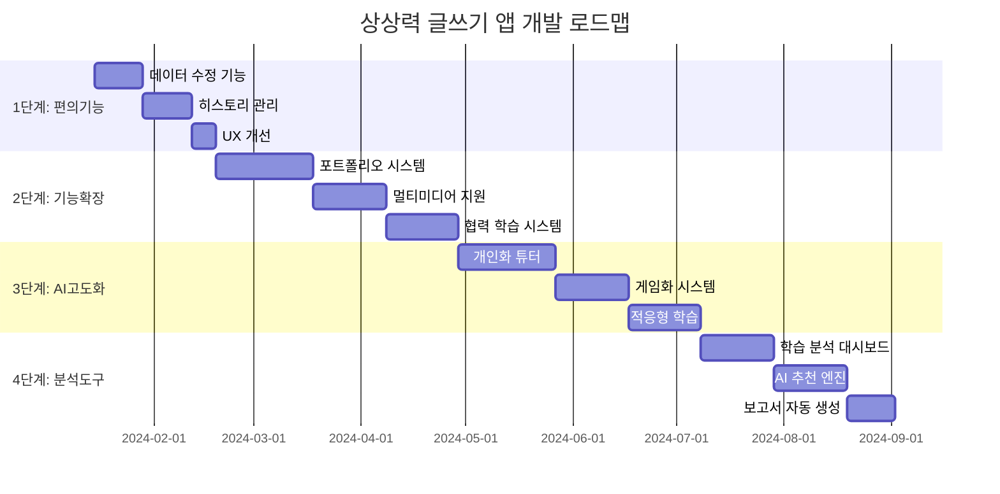

# 개발 로드맵 - 상상력을 펼치는 글쓰기 앱

## 📊 개발 우선순위 매트릭스

| 단계 | 기능 | 중요도 | 난이도 | 예상 기간 | 비즈니스 가치 |
|------|------|--------|--------|-----------|---------------|
| 1 | [핵심 편의 기능](#1단계-핵심-편의-기능) | 🔥 높음 | 🟢 하-중 | 2-3주 | 즉시 사용성 개선 |
| 2 | [기능 확장](#2단계-기능-확장) | 🔥 높음 | 🟡 중-상 | 4-6주 | 사용자 확보 |
| 3 | [AI 고도화](#3단계-ai-고도화) | 🔶 중-높음 | 🔴 상 | 6-8주 | 차별화 경쟁력 |
| 4 | [고급 분석](#4단계-고급-분석-도구) | 🔶 중간 | 🔴 상 | 4-5주 | 교육 전문성 |

---

## 1단계: 핵심 편의 기능

### 🎯 목표
- 현재 사용자들이 가장 불편해하는 점들을 해결
- 기본적인 CRUD(생성, 읽기, 수정, 삭제) 기능 완성
- 사용자 경험 개선으로 재방문율 증대

### 📋 세부 기능 목록

#### 1.1 데이터 수정 기능
**우선순위: 🔥 최고**
- **클래스 정보 수정**: 클래스명, 설명 변경
- **활동 내용 수정**: 생성된 활동의 제목, 설명 편집
- **학생 정보 관리**: 참여 학생 목록 관리

**구현 계획:**
```typescript
// 클래스 수정 API
export const updateClass = functions.https.onCall(async (data, context) => {
  const { classId, updates } = data;
  await admin.firestore().doc(`classrooms/${classId}`).update(updates);
});
```

**UI 개선:**
- 인라인 편집 (더블클릭으로 편집 모드 전환)
- 모달 기반 상세 편집
- 실시간 유효성 검사

#### 1.2 활동 히스토리 관리
**우선순위: 🔥 높음**
- **과거 활동 조회**: 날짜별, 클래스별 활동 목록
- **활동 복사**: 성공적이었던 활동 템플릿으로 재사용
- **활동 삭제**: 불필요한 활동 정리

**데이터 구조:**
```javascript
// classrooms/{classId}/activities 컬렉션 추가
{
  "title": "봄 풍경 묘사하기",
  "description": "봄 이미지를 보고 감성적인 문장 만들기",
  "status": "completed" | "in_progress" | "draft",
  "createdAt": timestamp,
  "completedAt": timestamp,
  "participantCount": 25,
  "resultSummary": {
    "totalWords": 120,
    "totalSentences": 45,
    "topKeywords": ["봄", "꽃", "따뜻한"]
  }
}
```

#### 1.3 사용자 경험 개선
**우선순위: 🔶 중-높음**
- **로딩 상태 개선**: 스켈레톤 UI, 프로그레스 바
- **에러 처리 강화**: 친화적인 에러 메시지, 복구 가이드
- **반응형 최적화**: 태블릿, 모바일 환경 개선

### 🚀 1단계 개발 일정

| 주차 | 작업 내용 | 담당자 | 완료 기준 |
|------|-----------|--------|-----------|
| 1주 | 데이터 수정 API 개발 | 백엔드 | CRUD 함수 완성 |
| 2주 | 편집 UI 구현 | 프론트엔드 | 인라인/모달 편집 |
| 3주 | 히스토리 기능 개발 | 풀스택 | 활동 목록 조회/관리 |
| 4주 | 사용자 경험 개선 | 프론트엔드 | 로딩/에러 처리 |

---

## 2단계: 기능 확장

### 🎯 목표
- 사용자 참여도와 만족도 증진
- 교육적 효과 극대화
- 플랫폼의 차별화 포인트 구축

### 📋 세부 기능 목록

#### 2.1 학생 포트폴리오 시스템
**우선순위: 🔥 최고**

**개념도:**
```
📊 [학생명]의 창작 포트폴리오
├── 📈 성장 지표
│   ├── 총 활동 참여: 12회
│   ├── 작성한 낱말: 45개
│   ├── 창작한 문장: 23개
│   └── 받은 공감: 67개
├── 📅 활동 타임라인
│   ├── 2024.03.15 - "봄 풍경" 활동
│   ├── 2024.03.10 - "우주 여행" 활동
│   └── 2024.03.05 - "친구와 놀이" 활동
└── 🏆 성취 배지
    ├── 🌟 첫 작품 완성
    ├── 💝 인기 작가 (공감 10개 이상)
    └── 🔥 연속 참여 (5회)
```

**기술 구현:**
```javascript
// 포트폴리오 데이터 집계 함수
export const generatePortfolio = functions.https.onCall(async (data) => {
  const { studentId, classId } = data;
  
  // 학생의 모든 활동 데이터 수집
  const activities = await getStudentActivities(studentId, classId);
  const words = await getStudentWords(studentId, classId);
  const sentences = await getStudentSentences(studentId, classId);
  
  // 통계 계산
  const stats = {
    totalActivities: activities.length,
    totalWords: words.length,
    totalSentences: sentences.length,
    totalLikes: sentences.reduce((sum, s) => sum + s.likesBy.length, 0),
    badges: calculateBadges(activities, words, sentences)
  };
  
  return { stats, activities, recentWorks: sentences.slice(-5) };
});
```

#### 2.2 멀티미디어 첨부 기능
**우선순위: 🔥 높음**
- **그림 첨부**: 학생이 그린 그림을 문장과 함께 업로드
- **음성 녹음**: 작성한 문장을 직접 읽어서 녹음
- **사진 업로드**: 관련 사진이나 스케치 첨부

**Firebase Storage 구조:**
```
📁 storage/
├── 📁 classes/
│   └── 📁 {classId}/
│       ├── 📁 activities/
│       │   └── 📁 {activityId}/
│       │       ├── 📁 images/
│       │       ├── 📁 audio/
│       │       └── 📁 documents/
│       └── 📁 portfolios/
│           └── 📁 {studentId}/
```

#### 2.3 협력 학습 시스템
**우선순위: 🔶 중-높음**
- **댓글 시스템**: 작품에 대한 구체적인 피드백
- **그룹 활동**: 팀별 공동 창작 프로젝트
- **발표 모드**: 우수 작품 전체 공유 및 발표

**댓글 데이터 구조:**
```javascript
// classrooms/{classId}/sentences/{sentenceId}/comments
{
  "authorId": "student-uid",
  "authorName": "김민수",
  "content": "정말 창의적인 표현이네요! 특히 '신비로운'이라는 단어가 인상적이에요.",
  "createdAt": timestamp,
  "likes": 3,
  "replies": [
    {
      "authorId": "original-author-uid",
      "authorName": "박지영", 
      "content": "고마워요! 다음에는 더 재미있는 단어를 써볼게요.",
      "createdAt": timestamp
    }
  ]
}
```

### 🚀 2단계 개발 일정

| 주차 | 작업 내용 | 우선순위 | 예상 공수 |
|------|-----------|----------|-----------|
| 1-2주 | 포트폴리오 시스템 기초 | 🔥 최고 | 40시간 |
| 3-4주 | 멀티미디어 업로드 | 🔥 높음 | 35시간 |
| 5-6주 | 댓글/피드백 시스템 | 🔶 중간 | 30시간 |
| 7-8주 | 그룹 활동 기능 | 🔶 중간 | 25시간 |

---

## 3단계: AI 고도화

### 🎯 목표
- AI 튜터의 교육적 효과 극대화
- 개별화된 학습 경험 제공
- 창의성 향상을 위한 정교한 AI 지원

### 📋 세부 기능 목록

#### 3.1 개인화 AI 튜터 시스템
**참조: 외부 컨텍스트 - AI 튜터 고도화 계획**

**핵심 개념:**
```javascript
// AI 튜터 페르소나 시스템
const createPersonalizedTutor = {
  // 수업 설명을 핵심 프롬프트로 활용
  lessonDescription: "너는 조선시대 문화를 설명하는 역사학자야. 왕 중심이 아닌 백성의 삶에 초점을 맞춰 설명해줘.",
  
  // 학생별 학습 스타일 분석
  studentProfile: {
    learningStyle: "visual" | "auditory" | "kinesthetic",
    creativityLevel: "beginner" | "intermediate" | "advanced",
    preferredTopics: ["nature", "adventure", "friendship"],
    recentPerformance: {
      participationRate: 0.85,
      creativityScore: 7.2,
      collaborationScore: 8.1
    }
  },
  
  // 맞춤형 응답 생성
  responseStrategy: {
    questioningStyle: "socratic", // 소크라테스식 질문법
    encouragementLevel: "high",
    hintFrequency: "moderate",
    vocabularyLevel: "elementary"
  }
};
```

#### 3.2 게임화 학습 시스템
**참조: 외부 컨텍스트 - 게임화 전략**

**레벨 및 경험치 시스템:**
```javascript
const gamificationSystem = {
  // 경험치 부여 기준
  expRewards: {
    "WORD_SUBMISSION": 5,      // 낱말 제출
    "SENTENCE_CREATION": 10,   // 문장 창작
    "PEER_FEEDBACK": 8,        // 동료 피드백
    "CREATIVE_THINKING": 15,   // 창의적 사고 발현
    "COLLABORATION": 12        // 협력 활동 참여
  },
  
  // 레벨별 혜택
  levelBenefits: {
    1: { title: "새싹 작가", unlocks: ["기본 배지"] },
    5: { title: "창의 탐험가", unlocks: ["특별 테마", "우선 발표권"] },
    10: { title: "상상력 마스터", unlocks: ["AI 멘토 모드", "작품 전시관"] }
  },
  
  // 성취 배지 시스템
  achievements: [
    {
      id: "first_sentence",
      title: "첫 문장 완성",
      description: "첫 번째 창작 문장을 완성했어요!",
      icon: "🌟",
      condition: { type: "sentence_count", value: 1 }
    },
    {
      id: "popular_author", 
      title: "인기 작가",
      description: "작품이 10개 이상의 공감을 받았어요!",
      icon: "💝",
      condition: { type: "total_likes", value: 10 }
    }
  ]
};
```

#### 3.3 적응형 학습 지원
**난이도 조절 및 개인화 힌트:**
```javascript
const adaptiveLearningEngine = {
  // 학생 상태 분석
  analyzeStudentState: (studentHistory) => {
    const recentActivities = studentHistory.slice(-5);
    const struggles = detectStruggles(recentActivities);
    const strengths = identifyStrengths(recentActivities);
    
    return {
      needsHelp: struggles.length > 2,
      confidenceLevel: calculateConfidence(recentActivities),
      suggestedSupport: generateSupportStrategy(struggles, strengths)
    };
  },
  
  // 동적 힌트 제공
  provideHints: (context, studentState) => {
    if (studentState.needsHelp) {
      return {
        type: "scaffolding",
        content: "이런 단어들은 어때요? '신비로운', '따뜻한', '즐거운'",
        level: "beginner"
      };
    } else {
      return {
        type: "challenge",
        content: "더 독창적인 표현을 써볼까요? 감정을 색깔로 표현해보면?",
        level: "advanced"
      };
    }
  }
};
```

### 🚀 3단계 개발 일정

| 기간 | 마일스톤 | 핵심 기능 | 성공 지표 |
|------|----------|-----------|-----------|
| 1-2주 | AI 페르소나 구축 | 개인화된 응답 생성 | 응답 만족도 > 80% |
| 3-4주 | 게임화 시스템 | 레벨/배지 시스템 | 재참여율 30% 증가 |
| 5-6주 | 적응형 학습 | 맞춤형 힌트 제공 | 학습 효과 20% 향상 |
| 7-8주 | 통합 및 최적화 | 전체 시스템 연동 | 사용자 피드백 수집 |

---

## 4단계: 고급 분석 도구

### 🎯 목표
- 교육 전문성 확보
- 데이터 기반 학습 개선
- 교사의 수업 설계 지원

### 📋 세부 기능 목록

#### 4.1 학습 분석 대시보드
**교사용 인사이트 제공:**
```javascript
const analyticsFeatures = {
  // 클래스 전체 분석
  classAnalytics: {
    participationTrends: "시간대별 참여율 그래프",
    creativityMetrics: "창의성 지수 변화 추이",
    collaborationPatterns: "학생 간 상호작용 네트워크",
    topicPreferences: "선호 주제 워드클라우드"
  },
  
  // 개별 학생 분석
  studentAnalytics: {
    learningProgress: "개인별 성장 곡선",
    strengthsWeaknesses: "강점/약점 레이더 차트",
    engagementLevel: "참여도 히트맵",
    peerComparison: "또래 대비 위치"
  },
  
  // 활동별 분석
  activityAnalytics: {
    effectivenessScore: "활동 효과성 점수",
    difficultyLevel: "적정 난이도 평가",
    timeSpentAnalysis: "단계별 소요 시간",
    outcomeQuality: "결과물 품질 평가"
  }
};
```

#### 4.2 AI 기반 학습 추천
**개인화된 다음 활동 제안:**
```javascript
const recommendationEngine = {
  // 학습 경로 추천
  suggestNextActivity: (studentProfile, classGoals) => {
    const recommendations = [
      {
        type: "skill_building",
        title: "어휘력 향상 활동",
        reason: "최근 다양한 형용사 사용이 부족해 보여요",
        difficulty: "medium",
        estimatedTime: "15분"
      },
      {
        type: "creativity_boost", 
        title: "상상력 확장 게임",
        reason: "창의적 표현력이 뛰어나네요! 더 도전해볼까요?",
        difficulty: "hard",
        estimatedTime: "20분"
      }
    ];
    
    return recommendations;
  },
  
  // 교사용 수업 설계 도움
  suggestClassActivity: (classProfile, learningObjectives) => {
    return {
      theme: "우정과 협력",
      imageKeywords: ["playground", "teamwork", "children"],
      expectedOutcomes: ["협력의 가치 이해", "감정 표현 능력 향상"],
      differentiationStrategies: [
        "초급: 단순 명사 위주 활동",
        "중급: 형용사와 동사 조합",
        "고급: 비유법과 은유 활용"
      ]
    };
  }
};
```

#### 4.3 성과 보고서 자동 생성
**포트폴리오 및 진도 보고서:**
```javascript
const reportGenerator = {
  // 학기말 종합 보고서
  generateSemesterReport: async (classId, period) => {
    const data = await aggregateClassData(classId, period);
    
    return {
      overview: {
        totalActivities: data.activities.length,
        studentProgress: calculateProgressMetrics(data.students),
        classHighlights: extractHighlights(data.outcomes)
      },
      
      studentReports: data.students.map(student => ({
        name: student.name,
        participationRate: student.stats.participationRate,
        creativityGrowth: student.stats.creativityTrend,
        portfolioHighlights: student.bestWorks,
        nextSteps: generatePersonalizedAdvice(student.profile)
      })),
      
      teacherInsights: {
        mostEffectiveActivities: rankActivitiesByEngagement(data.activities),
        suggestedImprovements: analyzeClassWeaknesses(data.outcomes),
        nextUnitRecommendations: suggestUpcomingThemes(data.preferences)
      }
    };
  }
};
```

### 🚀 4단계 개발 일정

| 월차 | 핵심 개발 | 목표 | 검증 방법 |
|------|-----------|------|-----------|
| 1개월 | 분석 대시보드 | 기초 통계 시각화 | 교사 피드백 수집 |
| 2개월 | AI 추천 시스템 | 개인화 추천 | A/B 테스트 진행 |
| 3개월 | 보고서 생성 | 자동 리포팅 | 실제 수업 적용 |
| 4개월 | 통합 최적화 | 전체 시스템 완성 | 성과 측정 |

---

## 📊 전체 개발 타임라인



## 🎯 성공 지표 (KPI)

### 사용자 지표
- **DAU (Daily Active Users)**: 일일 활성 사용자 수
- **참여 시간**: 평균 세션 지속 시간
- **완성률**: 활동 완료 비율
- **재방문률**: 7일/30일 재방문 비율

### 교육 효과 지표  
- **창의성 점수**: AI 평가 기반 창의성 지수
- **참여도**: 학생 적극 참여 비율
- **협력도**: 상호 피드백 활동 빈도
- **성장률**: 개인별 실력 향상 정도

### 기술 지표
- **응답 시간**: API 평균 응답 속도 (<200ms)
- **가용성**: 서비스 업타임 (>99.9%)
- **에러율**: 오류 발생 비율 (<0.1%)
- **확장성**: 동시 사용자 처리 능력

---

## 💡 혁신적 아이디어 (미래 비전)

### 🌟 차세대 기능 구상

#### VR/AR 창작 환경
- 가상현실 속에서 직접 이야기 세계 구축
- 증강현실로 현실 공간에 상상 속 캐릭터 배치
- 3D 공간에서의 협업 창작 경험

#### 음성/동작 인식 기술
- 자연어 음성 입력으로 즉석 창작
- 손짓, 표정 인식을 통한 감정 표현
- 실시간 음성-텍스트 변환 및 감정 분석

#### 크로스 플랫폼 연동
- 메타버스 플랫폼과의 연계
- 소셜 미디어 자동 공유
- 교육 LMS와의 완전 통합

#### AI 창작 파트너
- 학생과 함께 공동 창작하는 AI 캐릭터
- 실시간 피드백과 영감 제공
- 개인별 창작 스타일 학습 및 모방

---

## 🔧 기술적 도전과제

### 확장성 (Scalability)
- **동시 사용자**: 1,000명 → 10,000명 대응
- **실시간 동기화**: 지연 시간 최소화
- **데이터 처리**: 대용량 멀티미디어 관리

### 성능 최적화
- **이미지 최적화**: WebP, 적응형 해상도
- **캐싱 전략**: Service Worker, CDN 활용
- **코드 분할**: 필요 시점 로딩 (Lazy Loading)

### 보안 강화
- **개인정보 보호**: 학생 데이터 암호화
- **콘텐츠 필터링**: 부적절 내용 자동 차단
- **접근 제어**: 세밀한 권한 관리 시스템

---

## 📈 비즈니스 모델 확장

### 수익화 전략
1. **프리미엄 구독**: 고급 AI 기능, 무제한 저장공간
2. **기관 라이선스**: 학교/학원 대상 단체 계약
3. **콘텐츠 마켓플레이스**: 교사 제작 활동 템플릿 판매
4. **API 서비스**: 외부 교육 플랫폼에 기술 제공

### 시장 확장 계획
- **국내**: 초등학교 → 중학교 → 고등학교
- **해외**: 한국어 교육 기관 대상 글로벌 진출
- **수직 확장**: 타 과목 (수학, 과학) 적용
- **수평 확장**: 기업 창의성 교육 시장 진입

---

이 로드맵은 살아있는 문서로, 사용자 피드백과 기술 발전에 따라 지속적으로 업데이트될 예정입니다. 각 단계의 성공적인 완성을 통해 **상상력을 펼치는 글쓰기** 앱이 교육 혁신의 대표 플랫폼으로 성장하기를 기대합니다.